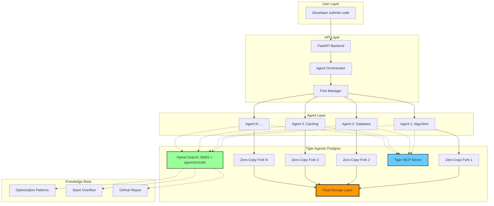

# ParallelProof

**Multi-Agent Code Optimizer powered by Tiger's Agentic Postgres**

ParallelProof spawns 50-100 AI agents simultaneously to optimize your code, each exploring different strategies in isolated database environments. What traditionally takes 40+ minutes now completes in 2-3 minutes.

[](https://parallelproof.demo.com)
[](LICENSE)
[](https://tigerdata.com)

## The Problem

Code optimization is:
- **Time-consuming**: Manual testing takes hours
- **Sequential**: Traditional approaches test one strategy at a time
- **Risky**: Production data needed, but testing is dangerous
- **Knowledge-limited**: Developers miss optimization patterns

## The Solution

ParallelProof leverages Tiger's **zero-copy database forks** to create 50-100 isolated environments in seconds, enabling:

✅ **Parallel exploration** - 100 agents test strategies simultaneously  
✅ **Zero-copy forks** - 2-3 seconds per fork vs 5-10 minutes traditional  
✅ **Real production data** - Safe testing without production risk  
✅ **Hybrid search** - BM25 + vector search finds optimization patterns  
✅ **Expert guidance** - Tiger MCP provides production-tested Postgres best practices

## Architecture



## Key Features

### 1. Zero-Copy Database Forks
Tiger's Fluid Storage creates database copies in 2-3 seconds using copy-on-write technology, storing only changed data instead of duplicating entire databases.

**Traditional Approach:**
```bash
# 10 GB database, 5-10 minutes to copy
CREATE DATABASE fork AS COPY OF production;
# Result: 10GB + 10GB = 20GB storage
```

**ParallelProof with Tiger:**
```bash
# 10 GB database, 2-3 seconds to fork
tiger service fork prod-db --now
# Result: 10GB + ~0GB = 10GB storage
```

### 2. Multi-Strategy Optimization

Each agent explores different optimization approaches:

| Strategy | Focus Area | Example Improvement |
|----------|-----------|---------------------|
| **Algorithmic** | Time complexity | O(n²) → O(n log n) |
| **Database** | Query optimization | 2000ms → 50ms |
| **Caching** | Redis/Memcached | 500ms → 10ms |
| **Data Structures** | Efficient collections | Array → HashMap |
| **Parallelization** | Concurrency | Sequential → Async |
| **Memory** | Resource usage | 1GB → 200MB |

### 3. Hybrid Search Knowledge Retrieval

Combines BM25 keyword search with vector embeddings:

```sql
-- BM25 for exact keyword matches
SELECT * FROM optimization_patterns
WHERE to_tsvector('english', description) 
      @@ plainto_tsquery('english', 'slow JOIN');

-- Vector search for semantic similarity
SELECT * FROM optimization_patterns
ORDER BY embedding <=> query_embedding
LIMIT 10;

-- Reciprocal Rank Fusion merges results
```

### 4. Tiger MCP Integration

Agents access 10+ years of Postgres expertise through Tiger's MCP server, getting tools for schema design, query optimization, and migrations with Postgres docs search built-in.

## Quick Start

### Prerequisites
- Node.js 18+
- Python 3.11+
- Tiger Cloud account (free tier available)

### Installation

```bash
# Install Tiger CLI
curl -fsSL https://cli.tigerdata.com | sh
tiger auth login

# Create main database
tiger service create parallelproof-main --plan free

# Clone repository
git clone https://github.com/yourusername/parallelproof
cd parallelproof

# Install dependencies
npm install          # Frontend
pip install -r requirements.txt  # Backend

# Setup environment
cp .env.example .env
# Add your Tiger connection string and OpenAI API key

# Run database migrations
tiger db connect parallelproof-main -f migrations/init.sql
```

### Usage

```bash
# Start backend
uvicorn app.main:app --reload

# Start frontend (separate terminal)
npm run dev

# Open browser
open http://localhost:3000
```

### Optimize Code

```python
# Via API
import requests

response = requests.post('http://localhost:8000/optimize', json={
    'code': '''
        SELECT u.*, COUNT(o.id) as order_count
        FROM users u
        LEFT JOIN orders o ON u.id = o.user_id
        GROUP BY u.id
        ORDER BY order_count DESC;
    ''',
    'language': 'sql',
    'num_agents': 50
})

print(response.json())
```

## Performance Benchmarks

| Metric | Traditional | ParallelProof | Improvement |
|--------|-------------|---------------|-------------|
| **Fork creation** | 5-10 min each | 2-3 sec each | **100-200x faster** |
| **Total optimization time** | 40-60 min | 2-3 min | **20-30x faster** |
| **Storage cost (100 forks)** | $500-1000/mo | ~$50/mo | **90% reduction** |
| **Code performance gain** | N/A | 14.6-30.9% | Research-backed |

## Technology Stack

- **Frontend**: React, TypeScript, TailwindCSS, Framer Motion
- **Backend**: FastAPI, Python 3.11+
- **Database**: Tiger Agentic Postgres
- **AI**: OpenAI GPT-4, Custom embedding models
- **Infrastructure**: Tiger Fluid Storage, Tiger MCP

## Tiger Agentic Postgres Features Used

1. **Zero-Copy Forks**: Instant database branching with copy-on-write storage
2. **Tiger MCP**: Production-safe Postgres expertise as prompts
3. **pg_textsearch**: BM25 ranked keyword search built for hybrid AI apps
4. **pgvectorscale**: High-performance vector search
5. **Fluid Storage**: Distributed block layer sustaining 110,000+ IOPS

## Project Structure

```
parallelproof/
├── app/
│   ├── main.py              # FastAPI application
│   ├── strategies.py        # Optimization strategies
│   ├── agents.py            # Agent implementations
│   └── fork_manager.py      # Tiger fork orchestration
├── frontend/
│   ├── components/
│   │   ├── Dashboard.tsx    # Real-time visualization
│   │   └── CodeEditor.tsx   # Code input interface
│   └── lib/
│       └── api.ts           # API client
├── migrations/
│   └── init.sql             # Database schema
└── tests/
    ├── test_agents.py       # Agent tests
    └── test_forks.py        # Fork management tests
```

## Contributing

We welcome contributions! See [CONTRIBUTING.md](CONTRIBUTING.md) for guidelines.

1. Fork the repository
2. Create feature branch (`git checkout -b feature/amazing`)
3. Commit changes (`git commit -m 'Add amazing feature'`)
4. Push to branch (`git push origin feature/amazing`)
5. Open Pull Request

## License

MIT License - see [LICENSE](LICENSE) file for details

## Acknowledgments

- **Tiger Data** for Agentic Postgres and zero-copy forks
- **MARCO Research** for multi-agent optimization framework
- **DEV Community** for the Agentic Postgres Challenge

## Resources

- [Tiger Cloud Docs](https://docs.tigerdata.com)
- [Tiger MCP Server](https://www.tigerdata.com/blog/free-postgres-mcp-prompt-templates)
- [Fluid Storage Architecture](https://www.tigerdata.com/blog/fluid-storage-forkable-ephemeral-durable-infrastructure-age-of-agents)
- [Zero-Copy Forks Guide](https://www.tigerdata.com/blog/fast-zero-copy-database-forks)

---

Built with ❤️ for the [Agentic Postgres Challenge](https://dev.to/devteam/join-the-agentic-postgres-challenge-with-tiger-data-3000-in-prizes-17ip)